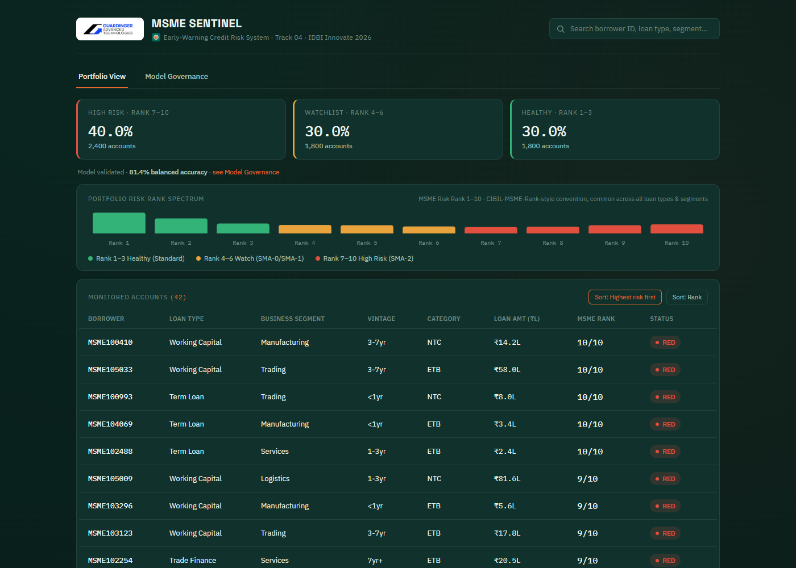
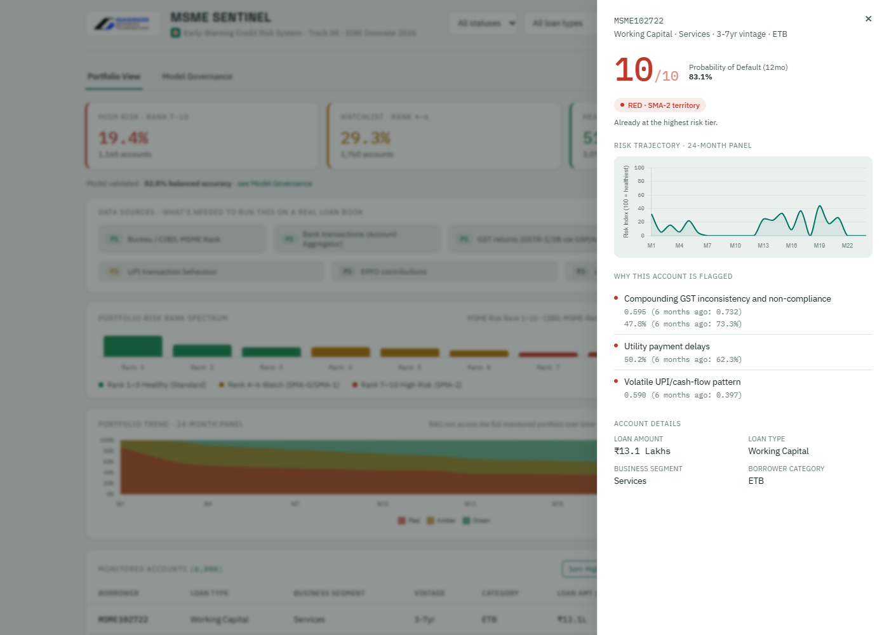

<p align="center">
  
  &nbsp;&nbsp;&nbsp;
  
</p>

# MSME Sentinel
### An Early-Warning System for MSME Credit Stress
**IDBI Innovate 2026 — Track 04: MSME Credit Predictive AI Risk Management**
**A prototype for IDBI Bank, developed by Guardinger Advanced Technologies**

**Live demo: [msme-sentinel.vercel.app](https://msme-sentinel.vercel.app/)** — the full 6,000-account portfolio, filterable and live, no setup required.

---

## The problem, as IDBI framed it

IDBI Bank's current MSME default-prediction capability sits at **16–22% accuracy**, relies solely on **structured data**, and uses fragmented methods across loan types and borrower segments. The bank wants a solution that flags potential stress **12 months in advance**, using both structured and unstructured/alternative data, with a consistent scoring framework across all MSME loans.

## Why we didn't just build "another classifier"

A single-shot, point-in-time classifier overclaims what a model can honestly deliver a full year out — MSME cash flows are volatile, and a naive high-accuracy claim on an imbalanced dataset is a well-known statistical trap (a model that always predicts "no default" can look >90% "accurate" while being useless).

**MSME Sentinel reframes the deliverable**: instead of a single binary prophecy, it is a continuously-updating **Early Warning System** that tracks each borrower's financial-health trajectory month over month, and flags *deteriorating trends* early enough for a loan officer to act — which is what "12 months in advance" is actually useful for.

## What it does

1. **Ingests** structured (bureau, financials, transactions) and alternative data (GST filing regularity, UPI/cash-flow volatility, utility payment consistency, EPFO contributions) — explicitly covering IDBI's New-to-Credit (thin-file) borrower case.
2. **Engineers trend features**, not just snapshots — 3- and 6-month rolling slopes and volatility per signal, because a deteriorating trend is the real early-warning signal, not a single bad month.
3. **Scores** each account with a segment-aware XGBoost ensemble, properly corrected for class imbalance (not optimized for a misleading raw-accuracy number).
4. **Calibrates** the raw probability into one common, comparable **CMR-style MSME Risk Rank (1–10)** — deliberately matching the real **CIBIL MSME Rank (CMR)** convention already used across Indian MSME lending for this exact exposure band and 12-month horizon, not the 300–900 scale used for personal/individual credit. A single scale across every loan type and borrower segment, resolving IDBI's "unified vs. segmented" ask with a concrete hybrid answer.
5. **Maps RAG status onto RBI's real SMA-0/SMA-1/SMA-2 early-warning classification** — not an invented 3-tier scheme. Green = Standard asset, Amber = SMA-0/SMA-1 territory, Red = SMA-2 (one step from NPA).
6. **Explains** every score with SHAP-derived, plain-English reason codes grounded in real underwriting signals (GSTR-1 vs GSTR-3B turnover consistency, GST filing compliance, EPFO regularity, cheque/NACH bounce rate) — each one quantified with its actual value and how it's moved over the account's own recent history, not just a label, and tagged with which data source it came from.
7. **Estimates a runway** to the next risk tier per account (a disclosed linear-extrapolation heuristic on top of the model's own trajectory, not a second model) and surfaces **rank movement** month over month, so an officer sees what's *newly* deteriorating, not just the same accounts they already know about.
8. **Tags every data source by real-world readiness** — Phase 1 (live channels IDBI already has: bureau, Account Aggregator bank transactions, GST, NACH bounce), Phase 2 (UPI, consent coverage still maturing), Phase 3 (EPFO, utility — opportunistic, never a blocker) — sourced from one manifest (`src/ingestion.py`) that both the dashboard's Data Sources panel and every reason code read from, so this isn't just a claim in a doc.
9. **Presents** it all across the full 6,000-account portfolio — filterable by status and loan type, paginated, not a curated sample — in a RAG (Red/Amber/Green) loan-officer dashboard with per-account trajectory charts. **The AI advises; the underwriter decides** — human-in-the-loop by design, not an autonomous approval/rejection engine.

See [`docs/domain_research.md`](docs/domain_research.md) for the full sourcing behind every feature and design choice above.

## Results (on our synthetic evaluation panel — see Data note below)

**Primary metric (per IDBI's literal ask — "accuracy improving to 90%"):**

| Metric | Value |
|---|---|
| **Balanced Accuracy** | **82.75%** (at optimal threshold 0.46) |

**Supporting rigor metrics — why this number can be trusted:**

| Metric | Value | Why this metric matters |
|---|---|---|
| AUC-ROC | **0.900** | Standard discrimination metric for imbalanced credit risk problems |
| KS-Statistic | **0.656** | Classic credit-scoring separation metric; >0.4 is considered strong, this is very strong |
| Gini Coefficient | **0.800** | Industry-standard scorecard quality metric (2×AUC−1) |
| Recall @ Early-Warning Threshold (0.30) | **0.927** | A deliberately different, more sensitive threshold for the early-warning use case, where missing a defaulter is costlier than a false alarm |

We report **balanced accuracy** as primary because IDBI's problem statement literally asks for "accuracy" — we answer that directly, just measured correctly for imbalanced data rather than using a naive figure that would be misleading here. See [`docs/metrics_note.md`](docs/metrics_note.md) for the full reasoning.

In the dashboard itself, these metrics live in a separate **Model Governance** view, deliberately kept apart from the Portfolio view a loan officer uses daily — model validation is a technical/audit concern, not something that belongs cluttering the operational screen.

## Data note — important

IDBI's real synthetic sandbox datasets and APIs are only released to shortlisted teams (per the orientation session Q&A). For this first-stage prototype, all data is a **self-generated synthetic MSME panel** (6,000 borrowers × 24 months) built with a causal generative model — defaults emerge from deteriorating alternative-data signals rather than being randomly assigned, so the model has genuine signal to learn and the SHAP explanations are meaningful, not noise. See [`src/data_generator.py`](src/data_generator.py) for the full generation logic. The pipeline is designed to swap in IDBI's real sandbox datasets with no architecture changes once shortlisted.

We deliberately did **not** substitute a real but domain-mismatched public dataset (e.g. personal/consumer credit datasets like Home Credit Default Risk) just to claim "real data" — that's a different lending domain (individual consumer credit vs. MSME business credit) and would be a worse choice than transparent, well-calibrated synthetic data, not a better one. Instead, we anchored our synthetic panel's overall stress rate to **real, published RBI/Finance Ministry MSME-sector Gross NPA figures** (9.87% in March 2021, down to 3.27% in September 2025) — see [`docs/data_calibration_note.md`](docs/data_calibration_note.md) for the full sourcing and reasoning. The individual borrower records are synthetic (necessarily — no public dataset pairs Indian MSME defaults with GST/UPI/EPFO signals), but the *rate* they're calibrated to is real and cited, not invented.

## The dashboard



Full 6,000-account portfolio, filterable by status and loan type, with a 24-month portfolio-level trend chart and a live Data Sources panel (tagging which alt-data channels are production-ready today vs. staged). Click any account for the drill-down below.



24-month trajectory, an estimated runway to the next risk tier, and quantified reason codes (each with its actual value, how it's moved over the last 6 months, and which data-source phase it came from) — not just a score and a label.

## Architecture


## Process Flow


## Repository structure

```
msme-sentinel/
├── src/
│   ├── data_generator.py     # Synthetic MSME data engine (causal default generation)
│   ├── features.py           # Snapshot + trend/slope + interaction feature engineering
│   ├── ingestion.py           # Data-source manifest: phase, real integration path, owned
│   │                          #   columns -- single source of truth for the dashboard's
│   │                          #   Data Sources panel and per-reason-code phase tags
│   ├── train_model.py        # Model training, hyperparameter search, calibration, SHAP
│   └── dashboard_export.py   # Scores + exports the full portfolio for the dashboard
├── dashboard/
│   ├── index.html            # RAG loan-officer dashboard (light, IDBI-branded theme)
│   ├── style.css
│   ├── app.js
│   ├── data.json             # Lightweight index: all 6,000 accounts, fast initial load
│   ├── details.json           # Per-account trajectory + reasons, lazy-loaded on first click
│   ├── assets/                # Logos (IDBI, Guardinger)
│   └── vendor/chart.umd.js   # Vendored Chart.js (no external CDN dependency)
├── scripts/
│   └── smoke_test.py          # Pre-deploy check: data.json/details.json valid & consistent
├── data/                      # Generated datasets + trained model + metrics (gitignored bulk files)
├── docs/
│   ├── domain_research.md            # Sourcing for every feature and design choice
│   ├── metrics_note.md               # Why balanced accuracy is primary, AUC/KS/Gini supporting
│   ├── data_calibration_note.md      # RBI NPA-rate sourcing for the synthetic default rate
│   ├── data_feasibility_tiering.md   # Which alt-data signals are adoptable, and when
│   ├── integration_architecture.md   # How this connects to IDBI's systems, technically
│   ├── deployment_guide.md           # Push + deploy steps
│   ├── demo_video_script.md          # 3-minute script, timed and fact-checked against live data
│   ├── pptx_slide_content.md         # Copy for the official submission template
│   ├── diagrams/                     # Architecture, process-flow, wireframe sources + renders
│   └── screenshots/                  # Current dashboard screenshots (used above and in the deck)
├── logos/                     # Source logo files (IDBI, Guardinger)
├── LICENSE                    # MIT
└── requirements.txt
```

## Running it locally

```bash
pip install -r requirements.txt
cd src
python data_generator.py      # generates the synthetic 24-month MSME panel
python features.py            # builds the feature matrix
python train_model.py         # trains the model, calibrates scores, computes metrics
python dashboard_export.py    # exports the curated dataset for the dashboard
cd ../dashboard
python -m http.server 8080    # serve the dashboard locally
# open http://localhost:8080
```

The dashboard is a static site (HTML/CSS/JS + a JSON data file, no backend) — deployable as-is to GitHub Pages, Netlify, or Vercel.

### Pre-deploy smoke test

Run this before every deploy to catch a broken/missing `data.json` before it reaches production:

```bash
python scripts/smoke_test.py
```

It asserts `dashboard/data.json` exists, parses as valid JSON, and contains a non-empty `accounts` array with the fields `app.js` depends on.

## Team

- **Team name:** Guardinger Advanced Technologies
- **Team leader:** Malay Doshi
- **Problem statement:** Track 04 — MSME Credit Default Prediction (Predictive AI Risk Management)

## Feasibility: what's adoptable now vs. later

Not every alternative-data signal in this model is equally ready to plug into a live bank system tomorrow.

- **Phase 1 (available today, no new infrastructure):** Bureau/CIBIL MSME
  Rank, bank transactions (via Account Aggregator), GST returns (via GSP/AA),
  cheque/NACH bounce data (already inside core banking). A pilot on just these
  four is realistic to stand up immediately, and per our SHAP feature-importance
  analysis, several of them are already among the model's highest-impact
  signals on their own.
- **Phase 2 (real, but consent/coverage still maturing):** UPI transaction
  behavior, added as borrowers complete Account Aggregator consent.
- **Phase 3 (genuinely useful, not a blocker):** EPFO contribution regularity
  and utility payment history — directionally valuable, but the weakest
  infrastructure today. EPFO in particular is **structurally absent**, not
  just thin, for the large share of MSMEs with no registered employees — our
  synthetic data models this honestly (~55% of simulated borrowers have no
  EPFO exposure at all, handled via a dedicated missing-data flag rather than
  a fabricated number).

Full reasoning and sourcing: [`docs/data_feasibility_tiering.md`](docs/data_feasibility_tiering.md).

**How this actually connects to IDBI's systems** — the ingestion pattern (API vs. batch, per source), deployment model (private VPC, not the public demo link), and what changes going from this prototype to a production pilot: [`docs/integration_architecture.md`](docs/integration_architecture.md).

## Roadmap

- Swap synthetic data for IDBI's real sandbox datasets/APIs — architecture requires no changes.
- Add account-level restructuring recommendations (not just flags).
- Extend segment-aware calibration with more granular industry/cluster benchmarks.
- Add a model monitoring layer (population stability index / drift detection) for production readiness.
